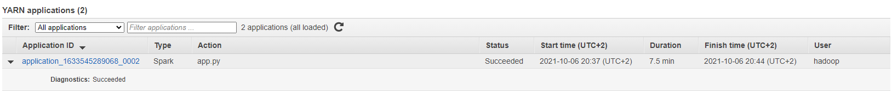
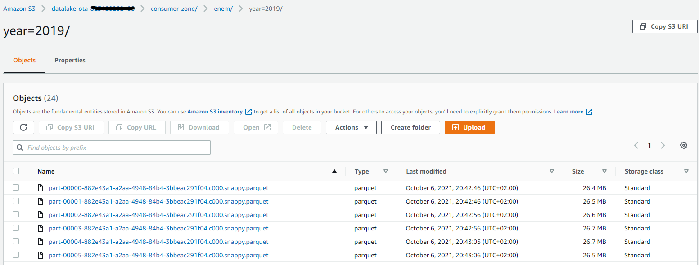
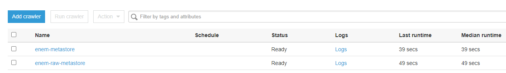
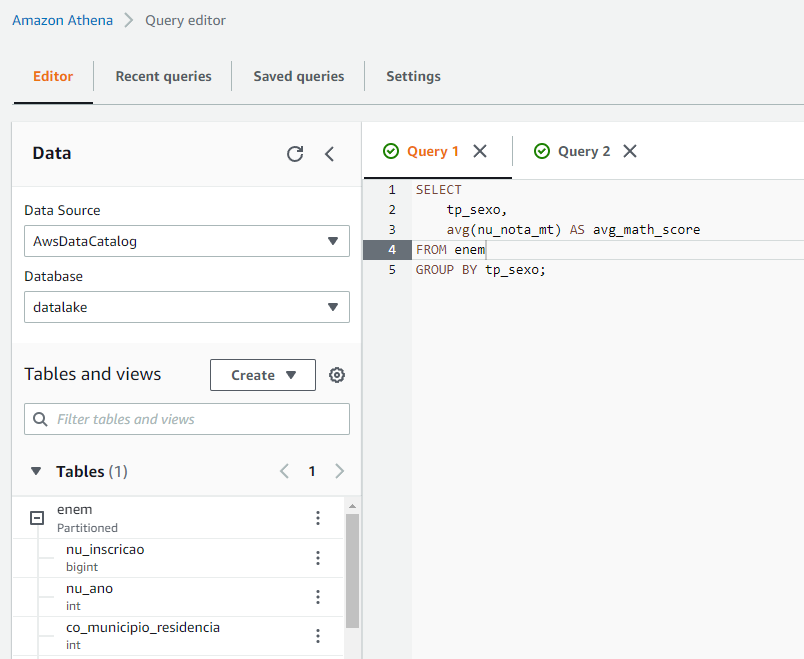
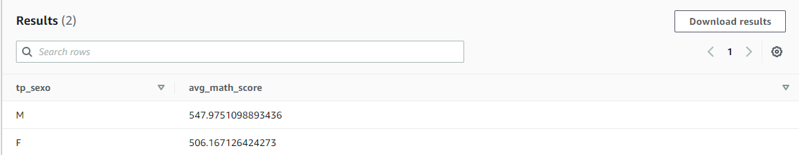

# Cloud Data Engineer Bootcamp

## Intruduction

This repo is for the activity proposed by IGTI in the Cloud Data Engineer Bootcamp.

It was made within AWS to practice this other cloud but I intend to create another one with Azure that I more used.

## Steps

### First

I created a python script to do the ingestion of ENEM 2019 file into AWS S3.

    I run it locally but the ideal is that run in a container on cloud or with Airflow.

### Second

I developed locally the PySpark code that will move the raw data to the consumer zone in parquet format.

    The development env is inside dev folder and was cloned from https://github.com/otacilio-psf/spark-dev-env-docker

    For local development I used a sample of the data with:
    head -n 10000 data/DADOS/MICRODADOS_ENEM_2019.csv > dev/sample_data.csv

### Third

I runned the Spark app inside of the AWS EMR cluster.

### Fourth

I used a crawler with AWS Glue to create the metastore for the consume zone.

### Fifth

I used the AWS Athena to create queries on the ENEM data to answer the questions in the first practical activity.

